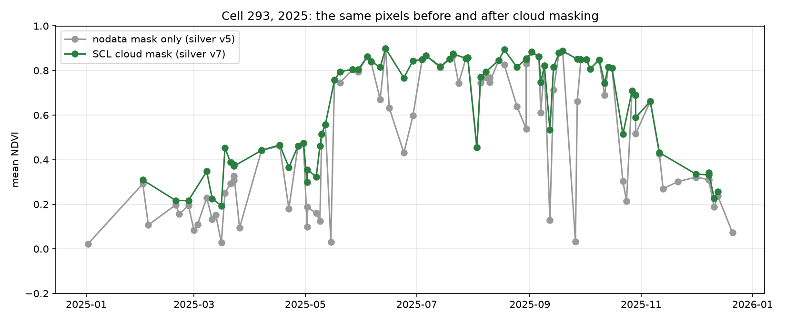
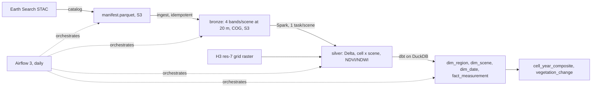

# s2-warehouse

Sentinel-2 imagery over Toronto and the GTA
(tile MGRS-17TPJ) turned into an incrementally
updated table of vegetation indices per H3 cell per date used to answer
one question:

> Where in the GTA did vegetation decrease between summer 2025 and summer 2026?

## The answer so far

- Summer 2026 was greener than 2025 across the tile (median summer NDVI change +0.037 over 1,345 land cells with 10th percentile -0.003). 
- One large local loss near Bolton / Caledon East with summer NDVI
  0.72 -> 0.37 with unchanged neighbours and a 2026 growing-season peak of only 0.46. 
- Crop rotation on the rural fringe produces summer drops of 0.2 with no land change; the classifier separates it by whether the growing-season peak held.



*The same cell, 2025. Grey: nodata mask only. Green: SCL cloud mask. The 17 removed dates had median NDVI 0.15, a forest reading as bare ground on cloudy days.*

## What is built



| Layer | What | Size |
|---|---|---|
| Manifest | scene list from STAC | 159 scenes |
| Bronze | 20m B03, B04, B08, SCL per scene | ~19 GB |
| Grid | H3 res-7 cell index raster + cells table | 2,621 cells, 1,345 land |
| Silver | Delta table, one row per cell per scene | 363k rows, 6 MB |
| Gold | star schema in DuckDB via dbt | 214k fact rows |
| Tests | pytest + dbt | 13 unit, 40 data tests |

Stack: Python 3.12, rasterio, h3, PySpark 4.2, Delta Lake 4.4, dbt-duckdb, Airflow 3.3 in Docker Compose, S3, GitHub Actions.


## Run it

Prerequisites: Python 3.12, uv, Java 17, Docker, an AWS account with an S3
bucket, `S2_BUCKET` set in `.env`.

```bash
uv sync
uv run python -m s2warehouse.catalog                    # manifest -> S3
uv run python -m s2warehouse.ingest --start 2025-07-04 --end 2025-07-05
uv run python -m s2warehouse.grid                       # once per tile
uv run python -m s2warehouse.silver --replace            # all scenes, ~7 min
cd dbt && uv run dbt deps && uv run dbt run && uv run dbt test && cd ..
uv run python -m s2warehouse.wh "select * from vegetation_change order by loss_rank limit 10"
```

Daily pipeline:

```bash
docker compose up airflow-init && docker compose up -d   # http://localhost:8080
```

## Layout

```
src/s2warehouse/   catalog, ingest, grid, silver, delta_lab, gate, metrics, ...
dbt/               staging, marts, ops models and tests
airflow/dags/      s2_daily.py
```
